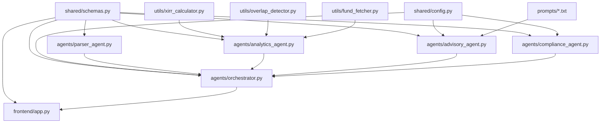

# FinSage AI — Detailed Implementation Plan

> **Hackathon**: ET AI Hackathon 2026 (Avataar.ai × Economic Times) — Track 9: AI Money Mentor
> **Deadline**: March 29, 2026 | **Today**: March 25, 2026 (4 days remaining)
> **Team**: Mayur (orchestration), Abhishek (analytics), Ayush (frontend)

---

## Architecture Confirmation

I've fully understood:
- **4-agent pipeline**: Parser → Analytics → Advisory → Compliance, orchestrated via LangGraph `StateGraph`
- **3 team members** working on independent branches (`orchestration`, `analytics`, `frontend`) with shared contracts in `shared/schemas.py` and `shared/config.py`
- **3 mandatory judge scenarios**: FIRE Path Plan, Tax Regime Optimisation, MF Portfolio X-Ray + Rebalancing
- **Judging rubric**: Autonomy Depth (30%), Multi-Agent Design (20%), Technical Creativity (20%), Enterprise Readiness (20%), Impact Quantification (10%)
- **Tech stack**: LangGraph, Gemini 1.5 Flash, pdfplumber/camelot, scipy, mftool, ChromaDB, Streamlit, Plotly, Docker

---

## Proposed Changes

### Phase 1 — Foundation (Day 1 Morning)

> **Goal**: Repo structure, shared contracts, config — unblocks ALL team members.

---

#### [NEW] [schemas.py](file:///d:/ET-AI-Hackathon26/shared/schemas.py)

All Pydantic models that serve as inter-agent data contracts. Every team member imports from here.

**Models & fields** (exact spec from prompt + enhancements):

| Model | Key Fields | Notes |
|---|---|---|
| `Transaction` | `fund_name`, `isin?`, `date`, `amount`, `units`, `nav`, `transaction_type` | Enum for transaction_type |
| `FundHolding` | `fund_name`, `isin?`, `current_value`, `invested_amount`, `units_held`, `expense_ratio`, `plan_type`, `top_holdings`, `category` | Added `category` (large-cap/mid/flexi) |
| `PortfolioAnalytics` | `holdings`, `overall_xirr`, `fund_wise_xirr`, `overlap_matrix`, `expense_ratio_drag_inr`, `total_current_value`, `total_invested` | Output of Analytics Agent |
| `UserFinancialProfile` | `age`, `annual_income`, `monthly_expenses`, `existing_investments`, `target_retirement_age`, `target_monthly_corpus`, `risk_profile`, `tax_bracket?`, `hra?`, `section_80c?`, `nps_contribution?`, `home_loan_interest?` | Extended for Tax Scenario B |
| `RebalancingAction` | `fund_name`, `action` (hold/exit/reduce/switch), `percentage`, `target_fund?`, `tax_impact`, `rationale` | Specific fund-level action |
| `FIREMilestone` | `month`, `year`, `equity_sip`, `debt_sip`, `gold_sip`, `total_corpus`, `equity_pct`, `debt_pct`, `notes` | Month-by-month FIRE row |
| `TaxRegimeComparison` | `old_regime_steps`, `new_regime_steps`, `old_total_tax`, `new_total_tax`, `recommended_regime`, `savings_amount`, `missed_deductions`, `additional_instruments` | Step-by-step for Scenario B |
| `HealthScoreDimension` | `dimension`, `score`, `rationale`, `suggestions` | One of 6 dimensions |
| `AdvisoryReport` | `rebalancing_plan: List[RebalancingAction]`, `fire_plan: FIREPlan`, `tax_analysis: TaxRegimeComparison`, `health_score: List[HealthScoreDimension]`, `audit_trail: List[str]` | Strongly typed (not raw dicts) |
| `FinalReport` | Inherits `AdvisoryReport` + `compliance_cleared`, `disclaimer`, `flagged_items` | Output of Compliance Agent |
| `PipelineState` | All above + `raw_text`, `transactions`, `analytics`, `user_profile`, `advisory_report`, `final_report`, `errors` | LangGraph state object |

---

#### [NEW] [config.py](file:///d:/ET-AI-Hackathon26/shared/config.py)

- `GEMINI_API_KEY` loaded from `.env` via `python-dotenv`
- `GEMINI_MODEL` = `"gemini-1.5-flash"`
- `CHROMA_PERSIST_DIR` = `"./data/chromadb"`
- `MAX_RETRIES` = 3
- `TEMPERATURE` = 0.3 (low for financial accuracy)
- `SEBI_DISCLAIMER` constant string
- `TAX_CONSTANTS` dict (old/new regime slabs, 80C limit, etc.)
- `STCG_THRESHOLD_DAYS` = 365

---

#### [NEW] [requirements.txt](file:///d:/ET-AI-Hackathon26/requirements.txt)

All consolidated dependencies:
```
langgraph, langchain-google-genai, langchain-core, google-generativeai,
pdfplumber, camelot-py[cv], pandas, numpy, scipy,
mftool, chromadb, sentence-transformers,
streamlit, plotly, fpdf2,
pydantic, python-dotenv, pytest
```

---

#### [NEW] Repo folder scaffolding

Create all directories and `__init__.py` files:
```
agents/, shared/, prompts/, utils/, frontend/, frontend/components/,
frontend/utils/, data/, data/fund_factsheets/, tests/, architecture/
```

Also create `.env.example`, `.gitignore`, empty placeholder files for Abhishek & Ayush.

---

### Phase 2 — Core Agent Logic (Day 1 Afternoon – Day 2)

> **Goal**: Each team member builds their core logic independently.

---

#### Mayur's Files

##### [NEW] [advisory_system.txt](file:///d:/ET-AI-Hackathon26/prompts/advisory_system.txt)

System prompt for Gemini — instructs it to act as a SEBI-registered-investment-advisor-equivalent AI. Includes:
- Role definition, output format requirements
- Instruction to produce specific fund-level actions (not vague)
- STCG avoidance rules
- JSON output mode instruction

##### [NEW] [fire_planner.txt](file:///d:/ET-AI-Hackathon26/prompts/fire_planner.txt)

Prompt template for FIRE planning:
- Input placeholders: `{age}`, `{income}`, `{existing_corpus}`, `{target_retirement_age}`, `{target_monthly_draw}`, `{risk_profile}`
- Output: month-by-month SIP breakdown, glidepath, insurance gap

##### [NEW] [tax_optimizer.txt](file:///d:/ET-AI-Hackathon26/prompts/tax_optimizer.txt)

Prompt template for tax regime comparison:
- Input placeholders: `{salary}`, `{hra}`, `{section_80c}`, `{nps}`, `{home_loan}`
- Output: step-by-step calculation both regimes, recommendation, missed deductions

##### [NEW] [advisory_agent.py](file:///d:/ET-AI-Hackathon26/agents/advisory_agent.py)

```python
class AdvisoryAgent:
    def __init__(self, model_name: str = config.GEMINI_MODEL)
    def generate_rebalancing_plan(self, analytics: PortfolioAnalytics, profile: UserFinancialProfile) -> List[RebalancingAction]
    def generate_fire_plan(self, profile: UserFinancialProfile) -> FIREPlan
    def generate_tax_analysis(self, profile: UserFinancialProfile) -> TaxRegimeComparison
    def generate_health_score(self, analytics: PortfolioAnalytics, profile: UserFinancialProfile) -> List[HealthScoreDimension]
    def run(self, state: PipelineState) -> PipelineState  # LangGraph node function
```

Key design decisions:
- Each sub-task (rebalancing, FIRE, tax, health score) is a **separate LLM call** with its own specialized prompt — this is more reliable than one mega-prompt
- Local calculations (tax slab math) done in Python, LLM used for interpretation and recommendations
- All outputs are parsed into Pydantic models (structured output via Gemini JSON mode)
- Audit trail: every LLM call logs input summary + output summary to `state.advisory_report.audit_trail`

##### [NEW] [compliance_agent.py](file:///d:/ET-AI-Hackathon26/agents/compliance_agent.py)

```python
class ComplianceAgent:
    BANNED_PHRASES: List[str]  # "guaranteed returns", "must buy", "risk-free", etc.
    def __init__(self)
    def scan_and_flag(self, report: AdvisoryReport) -> Tuple[List[str], AdvisoryReport]
    def add_disclaimers(self, report: AdvisoryReport) -> FinalReport
    def run(self, state: PipelineState) -> PipelineState  # LangGraph node function
```

- Rule-based scanning (no LLM needed — faster, deterministic)
- Regex patterns for absolute language ("you should definitely", "guaranteed")
- Adds SEBI disclaimer to all recommendation sections
- Flags items but doesn't remove them — marks them as `flagged_items` for transparency

---

#### Abhishek's Files (Reference — he builds these)

##### [NEW] [parser_agent.py](file:///d:/ET-AI-Hackathon26/agents/parser_agent.py)

```python
class ParserAgent:
    def parse_pdf(self, pdf_path: str) -> str  # raw text via pdfplumber
    def extract_transactions(self, raw_text: str) -> List[Transaction]
    def run(self, state: PipelineState) -> PipelineState
```

##### [NEW] [analytics_agent.py](file:///d:/ET-AI-Hackathon26/agents/analytics_agent.py)

```python
class AnalyticsAgent:
    def calculate_portfolio(self, transactions: List[Transaction]) -> PortfolioAnalytics
    def run(self, state: PipelineState) -> PipelineState
```

##### [NEW] [xirr_calculator.py](file:///d:/ET-AI-Hackathon26/utils/xirr_calculator.py)

```python
def calculate_xirr(cashflows: List[Tuple[date, float]]) -> float
```

##### [NEW] [overlap_detector.py](file:///d:/ET-AI-Hackathon26/utils/overlap_detector.py)

```python
def detect_overlap(holdings: List[FundHolding]) -> Dict[str, Dict[str, float]]
```

##### [NEW] [fund_fetcher.py](file:///d:/ET-AI-Hackathon26/utils/fund_fetcher.py)

```python
def get_fund_nav(scheme_code: str) -> float
def get_fund_details(scheme_code: str) -> Dict
def search_fund(query: str) -> List[Dict]
```

---

#### Ayush's Files (Reference — he builds these)

##### [NEW] [app.py](file:///d:/ET-AI-Hackathon26/frontend/app.py)

Main Streamlit app — PDF upload, sidebar, tab navigation.

##### [NEW] [portfolio_charts.py](file:///d:/ET-AI-Hackathon26/frontend/components/portfolio_charts.py)

Plotly pie charts, bar charts, overlap heatmap.

##### [NEW] [fire_planner_ui.py](file:///d:/ET-AI-Hackathon26/frontend/components/fire_planner_ui.py)

FIRE input form + timeline visualization.

##### [NEW] [health_score_ui.py](file:///d:/ET-AI-Hackathon26/frontend/components/health_score_ui.py)

Radar chart for 6 health dimensions.

---

### Phase 3 — Orchestration + Integration (Day 2 – Day 3)

---

#### [NEW] [orchestrator.py](file:///d:/ET-AI-Hackathon26/agents/orchestrator.py)

```python
from langgraph.graph import StateGraph, END

class FinSageOrchestrator:
    def __init__(self)
    def build_graph(self) -> StateGraph
    def run_pipeline(self, pdf_path: str = None, user_profile: UserFinancialProfile = None) -> FinalReport
```

**LangGraph StateGraph design**:
```
START → parser_node → analytics_node → advisory_node → compliance_node → END
                ↓ (on error)
          error_handler → END (graceful degradation)
```

- State: `PipelineState` (TypedDict for LangGraph)
- Each node function: takes state, returns partial state update
- Conditional edge after parser: if PDF parse fails → skip analytics, use manual input
- Conditional edge after advisory: if no profile → skip FIRE/tax, only do portfolio analysis
- Error recovery at each node: try/except → log to `state["errors"]`, continue with partial results

---

### Phase 4 — Scenario Testing (Day 3)

Test all 3 mandatory judge scenarios end-to-end.

#### Scenario A: FIRE Path Plan
- Create test fixture with exact inputs from rubric
- Verify month-by-month output, glidepath percentages, insurance gap
- Test dynamic update: change retirement age 50→55, verify output changes without full re-run

#### Scenario B: Tax Regime Optimisation
- Create test fixture: salary ₹18L, HRA ₹3.6L, etc.
- Verify step-by-step calculations under both regimes
- Verify exact liability numbers, optimal regime identification
- Verify missed deductions and additional instrument suggestions

#### Scenario C: MF Portfolio X-Ray
- Use synthetic CAMS PDF with 6 funds across 4 AMCs
- Verify XIRR calculation (not simple returns)
- Verify overlap detection (Reliance, HDFC, Infosys across 3 funds)
- Verify expense ratio drag in ₹ terms
- Verify rebalancing recommendations are fund-specific with tax context

---

### Phase 5 — Submission Polish (Day 4)

---

#### [NEW] [Dockerfile](file:///d:/ET-AI-Hackathon26/Dockerfile)

Multi-stage: Python 3.11-slim base, install deps, copy code, expose Streamlit port 8501.

#### [NEW] [docker-compose.yml](file:///d:/ET-AI-Hackathon26/docker-compose.yml)

Single service, env_file for `.env`, port mapping 8501:8501.

#### [NEW] [README.md](file:///d:/ET-AI-Hackathon26/README.md)

- Project overview, architecture diagram, setup instructions
- Demo screenshots, impact quantification section
- Team credits

#### [NEW] [finsage_architecture.md](file:///d:/ET-AI-Hackathon26/architecture/finsage_architecture.md)

1-2 page architecture document with agent flow, tech stack rationale, design decisions.

---

## Dependency Map



**Critical dependencies**:
1. `shared/schemas.py` **must be done first** — everyone imports from it
2. `shared/config.py` before any agent code
3. Abhishek's `parser_agent` + `analytics_agent` must be done before Mayur can do full integration testing (but Mayur can test with mock data)
4. Ayush can work entirely with mock `PortfolioAnalytics` / `FinalReport` objects until Phase 3

---

## Risks & Mitigations

| Risk | Severity | Mitigation |
|---|---|---|
| CAMS PDF format varies wildly | HIGH | Abhishek builds multiple parsing patterns + fallback to manual entry |
| Gemini rate limiting on free tier | MEDIUM | Cache LLM responses during dev, batch sub-tasks, retry with backoff |
| XIRR calculation divergence from expected | MEDIUM | Validate against known online XIRR calculators, add unit tests |
| mftool might be down | LOW | Cache fund data locally, fallback to hardcoded top-50 fund data |
| ChromaDB indexing slow on first run | LOW | Pre-index during Docker build, persist to volume |
| Tax calculation edge cases | MEDIUM | Hardcode 2025-26 tax slabs as constants, compute locally (no LLM for math) |
| Integration merge conflicts | MEDIUM | Only `shared/schemas.py`, `requirements.txt` are shared — minimal surface area |

---

## Verification Plan

### Automated Tests

1. **Unit tests for schemas**:
   ```
   cd d:\ET-AI-Hackathon26 && python -m pytest tests/ -v
   ```
   - Validate all Pydantic models serialize/deserialize correctly
   - Test edge cases: empty holdings, zero XIRR, missing optional fields

2. **Advisory agent tests** (`tests/test_advisory.py`):
   ```
   cd d:\ET-AI-Hackathon26 && python -m pytest tests/test_advisory.py -v
   ```
   - Mock Gemini responses, verify output parsing into Pydantic models
   - Test tax calculation math independently (no LLM)
   - Test compliance scanning catches banned phrases

3. **Integration test — full pipeline**:
   ```
   cd d:\ET-AI-Hackathon26 && python -c "from agents.orchestrator import FinSageOrchestrator; o = FinSageOrchestrator(); print(o.run_pipeline())"
   ```
   - Run with mock data, verify `FinalReport` output has all fields populated

### Manual Verification

1. **Scenario A/B/C**: Run each scenario through the Streamlit UI and verify outputs match rubric requirements — this is best done by Ayush once frontend is connected
2. **Docker**: Build and run `docker-compose up`, verify app accessible at `localhost:8501`
3. **README/Docs**: Review for completeness, ensure architecture diagram is readable

---

## Implementation Order (Mayur's Work)

1. ✅ `shared/schemas.py` — immediate
2. ✅ `shared/config.py` — immediate
3. ✅ Repo structure + push — immediate
4. `prompts/advisory_system.txt`, `fire_planner.txt`, `tax_optimizer.txt`
5. `agents/advisory_agent.py`
6. `agents/compliance_agent.py`
7. `agents/orchestrator.py` (with mock parser/analytics first)
8. `tests/test_advisory.py`
9. Integration testing with Abhishek's real agents
10. `Dockerfile` + `docker-compose.yml`
11. `README.md` + architecture doc
